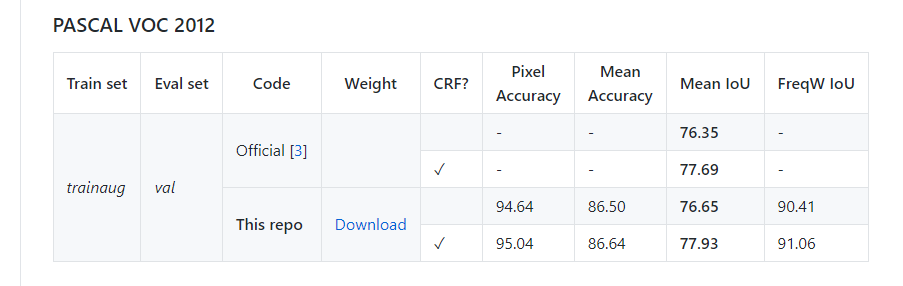

# DeepLab: Semantic Image Segmentation with Deep Convolutional Nets, Atrous Convolution, and Fully Connected CRFs

`deeplabpaddle`是复现的paddle代码
`deeplabpytorch`是原pytorch代码
`torch2paddle.py`是模型转化文件

需要安装第三方库omegaconf和pydensecrf，pydensecrf的Windows版可以在https://www.lfd.uci.edu/~gohlke/pythonlibs/#pydensecrf中找到安装命令如下：
```
pip install pydensecrf-1.0rc2-cp37-cp37m-win_amd64.whl
pip install omegaconf
```
由于git上传限制，模型需要先使用torch2paddle.py进行转化
```
python torch2paddle.py
```

运行paddle代码请使用
```
cd deeplabpaddle
python main.py train --config-path configs/voc12.yaml --cuda
```
运行测试代码可使用
```
python main.py test --config-path configs/voc12.yaml --model-path  data/models/voc12/deeplabv2_resnet101_msc/train/deeplabv2_resnet101_msc-vocaug.pdparams
```
运行crf测试
```
python main.py crf --config-path configs/voc12.yaml
```
paddle最终得分文件在`deeplabpaddle/data/scores/voc12/deeplabv2_resnet101_msc/val/scores.json`中，在VOC12上的miou为0.8987213899844988

pytorch最终得分文件在`deeplabpytorch/data/scores/voc12/deeplabv2_resnet101_msc/val/scores.json`中，在VOC12上的miou为0.8987214672262349

论文精度为：


由于git上传限制，项目完整代码、模型、训练日志和数据集均在百度网盘，链接有效期7天，

链接：https://pan.baidu.com/s/1HhUSPmh0JN261BtlN29klQ 

提取码：ddzj